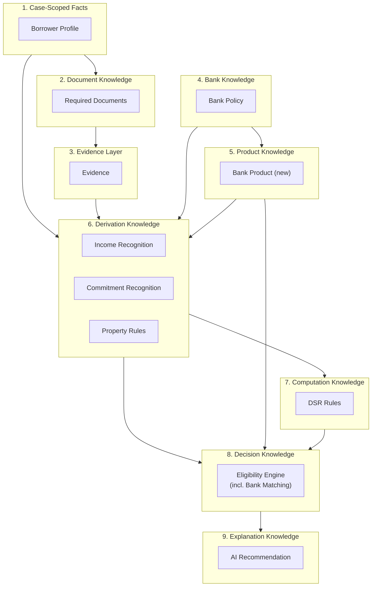
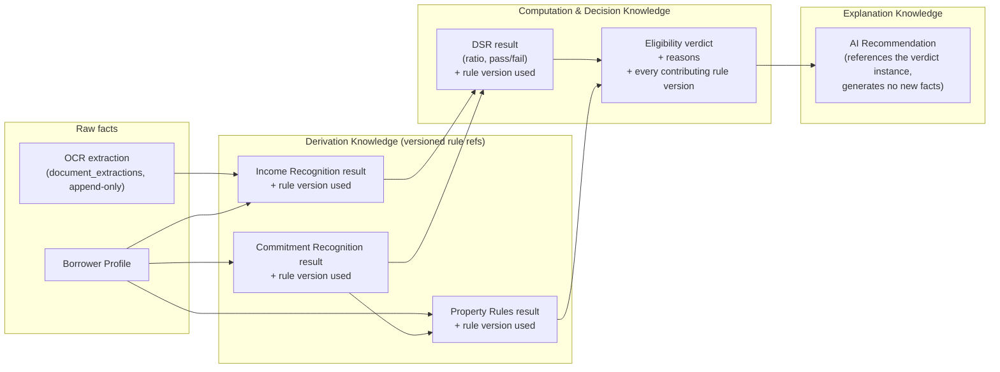
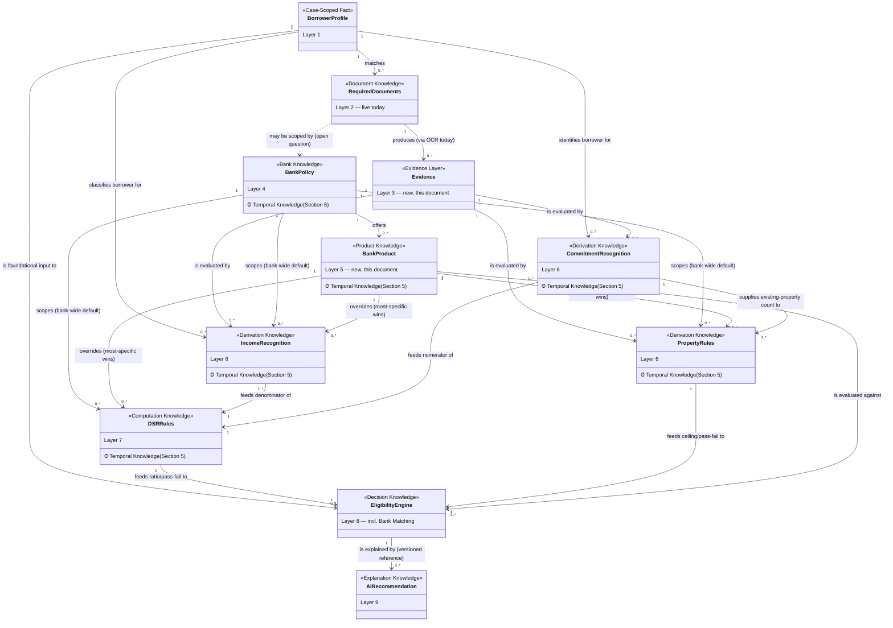

# Mortgage Knowledge Base — Technical & Architectural Design

Status: **Draft — architectural design only. Awaiting CTO approval before any
implementation begins.** Builds on, and does not supersede or lift the gate
of, [mortgage-knowledge-base-prd.md](mortgage-knowledge-base-prd.md).
Date: 2026-07-23
Author: system-architect (Sprint 6.3, Day 2 of the same scoping exercise)

Related: [Mortgage Knowledge Base PRD](mortgage-knowledge-base-prd.md) (the 9
conceptual models this document goes one level deeper on).

> Same discipline as yesterday's PRD: **no SQL, no migration files, no
> TypeScript or any other code, no UI/screen/wireframe design.** Diagrams
> below are Mermaid/ASCII documentation notation, not application code or
> schema DDL. No real bank policy numbers (DSR caps, haircuts, LTV limits)
> are invented here — every place one would eventually be needed is flagged,
> exactly as the PRD flagged them. This document does not authorize a
> migration, an ADR committing to a specific technical approach, or any code
> or UI work. Nothing here overrides an explicit human instruction to hold
> Sprint 6.3/Phase 4 implementation.

## Why this document exists

Yesterday's PRD named and defined 9 conceptual models and a linear pipeline
(`OCR → Rule Engine → DSR → Eligibility → Bank Matching → AI Recommendation`).
That was product-scoping work: what each model *means* and what it *contains*.
This document is architectural design one level deeper: how those 9 models
*organize* into a navigable structure (Section 1), how two of them — Bank
Policy and an open question the PRD explicitly left unresolved — expand into
full architectural layers (Sections 2–3), how raw facts become one shared
Evidence model independent of where they came from (Section 4), how every
versioned policy/rule domain shares one temporal-correctness principle
(Section 5), how an AI Recommendation stays accountable to the deterministic
facts it explains (Section 6), and how all of it fits together as one
conceptual graph rather than 9 separate write-ups (Section 7).

> **Sprint 6.3 Day 2 review note**: Sections 4 (Evidence Layer) and 5
> (Temporal Knowledge) were added after CTO review of the first version of
> this document, at the CTO's explicit request — see the Status section at
> the end. Everything else in this document is unchanged from that first
> version except the cross-references those two additions required.

Nothing here changes the PRD's status, lifts the Phase 4 gate referenced
there (`../ROADMAP.md`), or claims any part of this design is approved for
implementation.

---

## 1. Mortgage Knowledge Taxonomy

The PRD's 9 models are more than a flat list — they group into 9 knowledge
layers (9 PRD models, plus the new Product Knowledge Layer and Evidence
Layer this document adds, make 11 concepts total; see Section 7). Grouping
them gives the Knowledge Base a shape a future maintainer can navigate by
*kind of knowledge*, not just by pipeline position.

| Layer | Knowledge domain | Model(s) | What distinguishes this layer |
|---|---|---|---|
| 1. Case-Scoped Facts | Who the borrower is, structurally | Borrower Profile | The only layer describing the *applicant*, not a rule. Everything else is either evidence about the applicant or a rule applied to them. |
| 2. Document Knowledge | What evidence must be collected | Required Documents | Governs collection, not evaluation — a prerequisite gate, not a computation. Already live. |
| 3. Evidence Layer | Normalized facts, decoupled from their origin | Evidence (new — Section 4) | Not a PRD model. Introduced so Derivation Knowledge reasons over one shared fact shape, regardless of whether it came from OCR, manual entry, or a future source. |
| 4. Bank Knowledge | Who is lending, and their institutional policy | Bank Policy | Reference/anchor data. Nothing bank-specific downstream is meaningful without it (PRD's own framing, Section 2 below). |
| 5. Product Knowledge | What specific loan product is being evaluated | Bank Product (new — Section 3) | Not named as a distinct model in the PRD; introduced here to resolve the PRD's own open question. Sits between Bank Knowledge and the rule domains it can override. |
| 6. Derivation Knowledge | Converting Evidence into bank/product-recognized figures | Income Recognition, Commitment Recognition, Property Rules | All three share one shape: a piece of Evidence plus a bank/product-scoped treatment rule, producing a *recognized* figure. This is the PRD's "Rule Engine" pipeline stage made structural. |
| 7. Computation Knowledge | Combining recognized figures into a standard ratio | DSR Rules | The one purely arithmetic layer — no new raw facts enter here, only Derivation Knowledge outputs plus a threshold. |
| 8. Decision Knowledge | Producing a verdict with reasons | Eligibility Engine | The orchestration layer — the only place that produces an eligible/not-eligible/conditional verdict. "Bank Matching" is this layer evaluated across every candidate Bank Product, not a separate layer. |
| 9. Explanation Knowledge | Narrating an already-produced verdict | AI Recommendation | Strictly downstream and non-authoritative — explains Decision Knowledge, never replaces it (Section 6). |

**A cross-cutting principle, not a tenth layer**: Temporal Knowledge
(Section 5) does not appear as a row above — it isn't a layer at one point
in the pipeline. It's a property that applies *across* Layers 4–7 (Bank
Knowledge, Product Knowledge, Derivation Knowledge, Computation Knowledge):
every one of those is versioned policy/rule data, not a static fact, and
Section 5 formalizes what that means architecturally.



Three properties of this taxonomy are worth calling out explicitly:

- **Layers 1–3 are borrower/case/evidence-side; Layers 4–5 are
  bank/product-side; Layers 6–9 are the pipeline that reasons over both.**
  This is a cleaner organizing principle than the PRD's linear pipeline
  alone, because it explains *why* certain models are naturally bank-scoped
  (4–8) and others are not (1–3) — a question the PRD raised (Required
  Documents) but left open per-model rather than as a structural rule.
- **Layer 5 (Product Knowledge) did not exist as a named layer in the
  PRD.** It is introduced here because the PRD explicitly flagged, and did
  not resolve, "whether a bank's products need to be modeled separately
  from the bank itself." Section 3 resolves that architecturally.
- **Layer 3 (Evidence Layer) did not exist as a named layer in the PRD
  either.** The PRD's Income Recognition model (model 3) described its
  input as "OCR output... today" — accurate for what's live, but a
  coupling if left as architecture. Section 4 introduces Evidence as the
  shared shape Derivation Knowledge reasons over, so OCR becomes one
  Evidence-producing mechanism among several rather than baked into the
  Derivation layer's input contract.

**A note on pipeline wording**: CTO review (Sprint 6.3 Day 2) framed the
full pipeline as `Case Facts → Documents → Evidence → Bank Knowledge →
Product Knowledge → Derivation → Computation → Decision → Recommendation →
Explanation`. That maps directly onto Layers 1–9 above, with one
clarification: "Recommendation" and "Explanation" are the same Layer 9 /
AI Recommendation model (PRD model 9) described two ways — the model
*produces* a recommendation and *is* the explanation layer. This document
does not introduce a separate tenth model for either word.

---

## 2. Bank Knowledge Layer

The PRD treated Bank Policy (model 7) as a precondition, not a fully
designed layer. This section expands it.

### What it holds

Bank Knowledge is not one flat entity — it is a **bank identity anchor**
plus three (today: three; potentially four, pending the open question on
Required Documents) bank-scoped rule domains that already exist as separate
models in the PRD:

- **Bank identity** — the canonical, structured replacement for today's
  unconstrained free-text `bank_name` (`loan_cases`, `bankers`), flagged as
  a known gap in [../business/bank-rules.md](../business/bank-rules.md) and
  as unscoped Future Vision in
  [../business/product-vision.md](../business/product-vision.md). This
  document does not expand that scope — it is a precondition, exactly as
  the PRD said.
- **Income Recognition rules** (PRD model 3) anchored to a bank.
- **DSR Rules** (PRD model 5) anchored to a bank.
- **Property Rules** (PRD model 6) anchored to a bank.
- **Required Documents** (PRD model 2) — *conditionally*, only if the PRD's
  open question ("should Required Documents become bank-scoped?") is
  answered yes in a future scoping pass. Not assumed here.

Architecturally, Bank Knowledge is best understood as a **scoping dimension
that is threaded through three (or four) otherwise-independent rule
domains**, not a single table or a single concept with its own business
logic. The bank identity anchor is reference data; the rule domains are
where the actual policy content (haircuts, DSR caps, LTV limits — none
specified here) lives.

### How it's organized: bank-level default, product-level override

Section 3 introduces Bank Product as a child concept of Bank Knowledge. The
natural way for the two to interact — and the way that requires no new
matching concept, only the *reuse* of one that already exists — is
**wildcard/most-specific-wins scoping**, the same pattern
`src/lib/mortgage-rules/match-rule.ts` already implements for Required
Documents:

- A rule scoped to a bank with no product specified (a "product wildcard")
  is that bank's default treatment.
- A rule scoped to a specific bank *and* a specific product overrides the
  bank-wide default for that product only.
- Among matching rules for a given case, the most specific one wins — the
  exact algorithm already shipped, applied to a new dimension (bank/product)
  rather than the four borrower-profile dimensions it matches on today.

This is a design principle, not a schema decision — whether it is
implemented as a nullable `product_id`-style column (mirroring how
`mortgage_rules`' four profile dimensions are each independently nullable)
or some other shape is for `supabase-architect` if this proceeds. The point
architecturally is that **Bank Knowledge should not require a second,
different matching algorithm** — it should extend the one the codebase
already trusts.

### How the existing versioning pattern extends

`mortgage_rules` already ships `is_active`, `effective_from`, and
`effective_to` (Sprint 6.2 Phase 2 — see
[database.md](../architecture/database.md)), plus a governance posture of
**deactivate-only, no DELETE policy at all**, enforced at the database level
(see [security.md](../architecture/security.md)). This pattern extends to
every rule domain in the Bank Knowledge Layer conceptually as follows:

- Each of Income Recognition, DSR Rules, and Property Rules is, structurally,
  "another `mortgage_rules`" — a versioned, bank/product-scoped rule table
  with the same `is_active` / `effective_from` / `effective_to` shape,
  the same deactivate-only governance (a bank's DSR cap changing is a new
  version, not an edit to the old one), and the same "no rule data seeded by
  a migration, human-curated via SQL or a future admin UI" posture already
  established for `mortgage_rules`, `mortgage_rule_documents`, and
  `document_categories` ([0006](../decisions/0006-mortgage-rules-engine.md),
  [0007](../decisions/0007-mortgage-rule-admin.md)).
- This matters for more than consistency: `effective_from`/`effective_to`
  is the mechanism that lets a past Eligibility verdict remain explainable
  after the underlying bank policy changes. A DSR cap active in March and
  replaced in June must remain identifiable as "the rule that was in force
  when this March verdict was computed," not silently reinterpreted against
  today's rule. Section 6 (Explainable AI Architecture) depends on this
  directly, and Section 5 (Temporal Knowledge) formalizes this exact
  pattern as a principle spanning every rule domain in this Knowledge
  Base, not just Bank Knowledge — see that section rather than restating
  it here.
- Admin surface: if this layer is ever built, it would plausibly extend the
  `/settings/**`, `super_admin`-only admin pattern already established for
  mortgage rules ([0007](../decisions/0007-mortgage-rule-admin.md)) rather
  than invent a new one — not decided here, since no implementation is
  authorized by this document.

---

## 3. Product Knowledge Layer

The PRD's Bank Policy section (model 7) explicitly flagged this as an open
question and did not resolve it: *"Product(s) a bank offers, if products
need to be distinguished separately from the bank itself... flagged as an
open question, not resolved here."* This section resolves it architecturally.

### Decision: Product Knowledge is a distinct layer, not a Bank Policy attribute

A bank is not the unit a borrower is actually approved against — a mortgage
**product** is. Malaysian banks commonly offer multiple mortgage products
under one institution (e.g. conventional vs. Islamic financing, standard vs.
promotional/first-home programmes), each of which can carry materially
different terms. Modeling "Bank Policy" as a single flat entity would force
every DSR cap, margin-of-finance limit, and income treatment to be uniform
across an entire bank — which the PRD itself already anticipated might not
hold ("income recognition varies by bank" was stated at the *bank* level
throughout the PRD, but Malaysian underwriting variance is frequently at
*product* level, e.g. a bank's Islamic financing product having different
treatment than its conventional product at the same institution). No actual
product terms are asserted here — this is a structural claim, not a policy
one.

**Bank Product is therefore a distinct concept**: a Bank Product belongs to
exactly one Bank (Section 2's identity anchor); a Bank has one or more Bank
Products. No specific product names, rates, or terms are asserted here —
those are real bank data requiring the same "requires real bank policy
input, not invented" discipline as everything else in this design.

### What it holds (conceptual)

- Which Bank Policy (Section 2) it belongs to.
- Product identity (name, and whatever code/reference distinguishes it —
  not specified here, a future schema decision).
- Product-level classification, if any real distinction proves necessary
  (e.g. financing structure) — not enumerated here, requires real bank
  input.
- Active/versioning status, consistent with the same `is_active` pattern —
  a bank retiring a product should deactivate it, not delete it, so
  historical cases evaluated against it remain explainable (same reasoning
  as Section 2's versioning discussion, formalized in Section 5 (Temporal
  Knowledge), and Section 6 (Explainable AI Architecture)).

### Relationship to Bank Knowledge

Bank Product is a **child concept of Bank Knowledge, and the optional
most-specific scope** for the three bank-scoped rule domains (Income
Recognition, DSR Rules, Property Rules) described in Section 2. A rule can
be authored at the bank level (applies to every product by default) or
overridden at the product level (applies to that product only) — the same
wildcard/most-specific-wins relationship, not two separate concepts with
independent logic.

### Relationship to Eligibility Engine / Bank Matching

This is the resolution that matters most: **the Eligibility Engine's unit
of evaluation is a Bank Product, not a Bank.** The PRD already described
Bank Matching's output as "a ranked/filtered list of viable banks *and
products*" — this section makes that explicit and structural rather than a
parenthetical. Concretely:

- The Eligibility Engine (PRD model 8) produces one verdict per
  case × Bank Product pair, not per case × Bank pair. Two products at the
  same bank can legitimately produce two different verdicts for the same
  case (different DSR caps, different margin-of-finance limits).
- "Bank Matching" (the pipeline stage) is the Eligibility Engine evaluated
  across every candidate Bank Product for a case — a refinement of, not a
  contradiction to, the PRD's original framing ("evaluated across every
  candidate Bank Policy record" now reads as "every candidate Bank Product
  record scoped by its Bank Policy").
- This also affects Required Documents' open question from the PRD: if
  Required Documents ever becomes bank-scoped, the same question applies
  one level deeper — bank-scoped or product-scoped? Not resolved here;
  flagged as an extension of the PRD's existing open question, not a new
  one this document is answering.

---

## 4. Evidence Layer

CTO framing (Sprint 6.3 Day 2 review): "Evidence becomes the single source
of truth for every AI agent." This section adds Evidence as a distinct
layer, sitting between Document Knowledge and Bank Knowledge in the
taxonomy (Section 1) — decoupling *what a rule evaluates* from *where that
fact came from*.

### The problem this section solves

The PRD's Income Recognition model (model 3) described its input, as it
exists today, plainly: it "consumes OCR output (`SalarySlipFields`
today...)." That's an accurate description of what's live — Gemini OCR is,
today, the only mechanism producing income-relevant facts. Left as
architecture, though, it's also a coupling: it ties three separate
Derivation Knowledge models (Income Recognition, Commitment Recognition,
Property Rules) to one provider's output shape. A future manual-entry path
(a banker keying in a declared income figure when no salary slip exists),
a credit bureau integration for commitments, a bank-statement parser, or a
future AI extractor would each require Income/Commitment/Property Rules to
grow a new, provider-specific input case — the opposite of the
`OCRProvider` interface discipline this codebase already applies one layer
down ([0008](../decisions/0008-ocr-and-ai-case-summary.md)).

### What Evidence conceptually holds

Evidence is a **normalized fact record, decoupled from its origin** — e.g.
"recognized raw income figure: RM X, source: salary slip OCR" or "existing
car loan instalment: RM Y, source: banker manual entry" — regardless of
which mechanism produced it. Conceptually, an Evidence record carries:

- **Evidence type/category** — what kind of fact this is (an income
  figure, a commitment figure, a property attribute, an identity fact) —
  not enumerated exhaustively here, mirroring the PRD's discipline of not
  inventing a fixed vocabulary ahead of real requirements.
- **The value itself** — the normalized fact, already shaped for what a
  Derivation Knowledge rule needs, not a raw provider payload a rule has
  to parse itself.
- **Source/origin** — extensible, not a fixed enum tied to one provider:
  OCR (today's Gemini extraction), manual banker entry, customer
  self-declaration, a future API/credit-bureau integration, a future
  bank-statement parser, or a future AI extractor. A new origin is a new
  *value* of this dimension, not a new input shape Derivation Knowledge
  has to learn to read.
- **A reference back to the source document/declaration** — for
  traceability, so Evidence never becomes an unverifiable, disconnected
  number. This is the same provenance goal Section 6 (Explainable AI
  Architecture) depends on for its reasoning chain — an Evidence record is
  itself a link in that chain, not a separate concern.
- **Captured-at timestamp and capturing actor** — who or what produced
  this Evidence and when, consistent with `CLAUDE.md`'s auditability
  principle, the same posture as today's append-only `document_extractions`
  table (every OCR attempt kept, never overwritten — see
  [database.md](../architecture/database.md)).

### The architectural move: Derivation Knowledge evaluates Evidence, not raw provider output

**Income Recognition, Commitment Recognition, and Property Rules (PRD
models 3, 4, and 6) should evaluate Evidence, not OCR output directly.**
This reframes, but does not change, what's live today: OCR extraction into
`document_extractions` is unchanged, exactly as implemented — Gemini OCR
remains the only mechanism producing income/identity Evidence right now.
What changes is the *designed* input shape one layer up: Derivation
Knowledge rules are written against the Evidence model's shape, and OCR
becomes one Evidence-producing mechanism among several rather than a shape
baked into the Derivation layer's own input contract. A future
manual-entry path, credit bureau integration, or new AI extractor becomes
a new way to *produce* Evidence — Derivation Knowledge does not need to
change to accommodate it.

This is the same discipline `OCRProvider` already applies one layer down
(application code depends on an interface, not a specific vendor —
[0008](../decisions/0008-ocr-and-ai-case-summary.md)); Evidence applies it
one layer up, so every AI component (OCR today, any future extractor)
stays independent while sharing one common evidence model — directly the
CTO's stated goal: "This keeps every AI component independent while
sharing a common evidence model."

### Relationship to the rest of the taxonomy

- **Upstream**: Required Documents (Layer 2) and, later, any other
  Evidence-producing mechanism (manual entry, a future integration) feed
  Evidence.
- **Downstream**: Income Recognition, Commitment Recognition, and Property
  Rules (Layer 6, Derivation Knowledge — Section 1) consume Evidence, not
  raw provider output, as their designed input.
- **Not modeled as separate ontology nodes**: manual entry, customer
  self-declaration, and future integrations are described here as
  conceptual *origins* of Evidence, not as additional entities in Section
  7's ontology diagram — none of them exists as a distinct model in the
  PRD's 9, and inventing new ones is outside this document's scope. The
  ontology diagram shows Evidence's one currently-live producer (Required
  Documents, via OCR) as an illustration, not an exhaustive list of
  origins.

No implementation is required or authorized by this section — it is a
design reframing of how Derivation Knowledge's inputs are structured, for
if and when the models below Layer 2 are ever built. It does not require
any change to what's live today (`document_extractions`, OCR extraction,
or anything else in `src/lib/ocr/`).

---

## 5. Temporal Knowledge

CTO framing (Sprint 6.3 Day 2 review): "Knowledge is not static. Every
bank policy, product, DSR rule, income recognition rule and property rule
changes over time." Illustrative chain:

```
Knowledge → Version → Effective From → Effective To
```

This is a **cross-cutting architectural principle, not a pipeline stage or
a new layer in Section 1's table** — it applies across Bank Knowledge
(Section 2), Product Knowledge (Section 3), and every Derivation/
Computation rule domain (Income Recognition, Commitment Recognition,
Property Rules, DSR Rules — Layers 6–7 in Section 1). This section names
that principle explicitly and generalizes a pattern the codebase has
already shipped once, rather than inventing a new one.

### The pattern already shipped, generalized

`mortgage_rules` already ships exactly this shape — `is_active`,
`effective_from`, `effective_to`, deactivate-only governance with no
DELETE policy at all, enforced at the database level (Sprint 6.2 Phase 2;
see [database.md](../architecture/database.md) and
[security.md](../architecture/security.md)). Sections 2 and 3 already
described this pattern extending to Bank Policy, Bank Product, Income
Recognition, DSR Rules, and Property Rules individually. **Temporal
Knowledge is that same description, stated once, as a principle every
versioned concept in this Knowledge Base shares** — including Commitment
Recognition, for the same reason as its sibling Derivation Knowledge
models — rather than restating it independently, and potentially
inconsistently, in each section. Concretely, for every one of those
concepts:

- **Every policy/rule record is versioned, never overwritten in place.**
  A bank changing its DSR cap, an income haircut percentage changing, a
  margin-of-finance limit tightening — each is a *new version*, with its
  own `effective_from`, not an edit to the row that represented the old
  policy. This is the same deactivate-only discipline already enforced
  for `mortgage_rules`, `mortgage_rule_documents`, and
  `document_categories` ([0006](../decisions/0006-mortgage-rules-engine.md),
  [0007](../decisions/0007-mortgage-rule-admin.md)).
- **The Eligibility Engine must always evaluate against the policy
  version that was effective on the case's relevant date — not "the
  current version at query time."** A case's DSR calculation, run today,
  must use whichever DSR Rule version had `effective_from ≤ today <
  effective_to` (or no `effective_to` yet) at the time it runs — the same
  principle applies symmetrically when re-examining a *past* verdict:
  which version was effective *then*, not which is effective *now*.
- **Historical decisions must remain explainable even after future policy
  changes.** A verdict computed in March, referencing a DSR cap active at
  that time, must stay interpretable in July even after the bank raises
  or lowers that cap in June. This is the normal operating condition of a
  system whose reference data changes over time while past decisions must
  remain auditable, per `CLAUDE.md`'s auditability principle — not a
  hypothetical edge case.

### Relationship to Section 6 (Explainable AI Architecture)

Section 6 already flags a "tension... surfaces but does not resolve":
whether every Eligibility run must be *persisted* as a frozen,
computation-time snapshot, or only recomputed live. **Temporal Knowledge
does not resolve that tension — it explains why it exists.** Temporal
correctness (evaluating against the version that was effective at the
relevant time) requires *knowing which version was effective when a
computation ran*; whether that knowledge is captured by persisting the
verdict itself, by reconstructing it from `effective_from`/`effective_to`
timestamps after the fact, or by some other mechanism, is exactly the
schema-level question Section 6 leaves open. This section formalizes the
*requirement*; Section 6, and eventually a real schema proposal, has to
decide the *mechanism*.

### No implementation authorized

Same discipline as the rest of this document: this section names an
architectural principle every versioned rule domain must satisfy. It does
not specify a table shape, a trigger, or a migration — whether the
pattern is implemented via reused `is_active`/`effective_from`/
`effective_to` columns on each new rule table, a shared
temporal-versioning convention documented once for `supabase-architect`
to apply consistently, or some other mechanism, is an implementation
decision this document does not make.

---

## 6. Explainable AI Architecture

The PRD's AI Recommendation model (model 9) established the governing
principle, directly extending
[0008](../decisions/0008-ocr-and-ai-case-summary.md)'s precedent (Gemini OCR
plus one AI-generated, never-stored, on-request "Next Action" field, with
every fact a banker acts on computed live from real tables): **AI explains
already-computed deterministic facts; it never generates them.** This
section designs the architecture that makes that principle actually
enforceable and auditable, rather than a stated intention.

### The problem this section solves

A recommendation is worthless to a banker — and a liability to a compliance
reviewer — if it can't be traced back to *why*. "Why did the AI say this
bank is eligible" must be answerable not with "the AI decided," but with a
concrete, reconstructable chain: which DSR figure, which Eligibility
verdict, and which specific versions of which rules produced them, as of
when the computation ran.

### Reasoning-chain architecture

Model each pipeline stage's output not just as a value, but as a **fact with
provenance** — conceptually, every computed figure or verdict carries a
reference to the specific inputs and rule versions that produced it, not
just the number itself:



The essential property: **every arrow into `AIr` passes through `ELIGr`,
never around it.** An AI Recommendation that referenced raw Borrower
Profile or OCR data directly — bypassing the deterministic chain — would
violate the core principle and should be treated as a design defect, not a
shortcut.

### What needs to be recorded/referenced (architecturally, not as final schema)

For a banker or a future compliance reviewer to always be able to answer
"why did the AI say this," the chain above needs, at minimum, these
properties — described architecturally, not as table designs:

- **Every rule-domain result (Income Recognition, Commitment Recognition,
  Property Rules, DSR Rules) needs a reference to the exact rule version
  that produced it** — not just "the current rule," but the specific row,
  identified by its `is_active`/`effective_from`/`effective_to` state at
  computation time (Section 2). This is what makes a result reproducible
  after the underlying bank policy later changes.
- **The Eligibility verdict is the aggregation point** — it needs to
  reference every contributing rule version (Income Recognition, Commitment
  Recognition, DSR Rules, Property Rules) it used, exactly as the PRD's
  model 8 already specified ("a record of *which version* of each
  contributing rule... produced this result"). This document adds that the
  verdict must also record *which Bank Product* it was evaluated against
  (Section 3) and *when* it was computed.
- **The AI Recommendation references a specific Eligibility verdict
  instance, not a live query.** Consistent with the PRD's model 9 attribute
  list ("a versioned reference, not a live recomputation it does itself"),
  and consistent with 0008's existing pattern of the Next Action field being
  generated fresh on request rather than cached — the recommendation is
  regenerated against a specific, already-computed verdict, never against a
  silently-recomputed one.
- **Provenance of "who/what and when"** — per `CLAUDE.md`'s auditability
  principle ("every state change should be traceable to who did it and
  when"), each stage in this chain should record who or what triggered the
  computation (a user action, or a system recomputation) and when. This is
  not a new invention — it is architecturally the same posture already
  applied to `document_extractions` (append-only, every OCR attempt kept,
  never overwritten) and `loan_case_required_document_events` (append-only
  event trail) — see [database.md](../architecture/database.md). The
  Eligibility/DSR/Derivation layers would need an equivalent
  append-only-provenance posture if built, not a mutable "current state"
  table that silently drifts as rules change.

### A tension this design surfaces but does not resolve

Rules change over time (a bank revises its DSR cap). A historical
Eligibility verdict shown to a banker weeks later must remain explainable
*as of when it was computed*, not silently reinterpreted against today's
rules. This pushes toward Eligibility (and its contributing Derivation/
Computation results) needing to be **persisted, frozen-at-computation-time
facts**, not ephemeral, recompute-on-read values — a materially different
persistence posture than today's "Next Action" field, which is deliberately
never stored. Whether every Eligibility run is persisted, or only ones a
banker explicitly requests/acts on, and what retention/access policy
applies to that persisted data, is an open design question this document
surfaces but does not resolve — it belongs to a future, more detailed
scoping pass, not this document. See Section 5 (Temporal Knowledge) for
*why* this tension exists — temporal correctness requires knowing which
rule version was effective when a computation ran; that section names the
requirement, it does not decide the schema-level answer either.

### Compliance and security posture

This is, as the PRD already said of AI Recommendation, the most sensitive
model in the whole Knowledge Base — it touches real lending decisions and
real customers' money, and (per this section) would involve recognized
income figures, DSR ratios, and eligibility reasoning flowing into an AI
provider prompt, adjacent to the PII already flowing through Gemini OCR
today under [0008](../decisions/0008-ocr-and-ai-case-summary.md). Per the
PRD's own compliance flag and `CLAUDE.md`'s Approval Workflow
("security-sensitive changes... require a `security-reviewer` pass before
being considered mergeable"), **this model requires a `security-reviewer`
pass before any implementation** — specifically covering what data is
minimized/excluded from the AI prompt (e.g. whether raw NRIC or full
commitment detail ever needs to reach the provider, versus only recognized
aggregate figures), and how the persisted reasoning-chain data itself is
access-controlled, on top of whatever review the deterministic Derivation/
Computation/Decision layers already require. This document does not perform
that review — it flags where it is needed, same discipline as the PRD.

---

## 7. Mortgage Domain Model (Ontology)

The diagram below shows all 9 PRD models plus the Product Knowledge Layer
(Section 3) and the Evidence Layer (Section 4) — 11 concepts total — as one
conceptual graph, with labeled relationships. Solid edges are relationships
already established by the PRD or resolved by this document; dashed edges
are open questions, not decided by either document. A `⏱ Temporal
Knowledge` annotation marks every concept Section 5 applies to — every
versioned policy/rule domain — rather than adding a separate edge to a
"Version" node, to keep the graph readable.



Reading the graph:

- **Layers 1–3 (top)** are the only concepts not scoped by a bank — they
  describe the borrower, the evidence collected about them, and the
  documents that produced it, independent of which bank is ultimately
  being evaluated.
- **Layers 4–5** are pure reference/scoping data — nothing computes
  anything by itself, but everything in Layers 6–8 depends on them for
  which policy to apply. Every concept in these two layers also carries
  the `⏱ Temporal Knowledge` annotation (Section 5): none of them is a
  static fact, all are versioned.
- **Layers 6–7** are where Evidence becomes recognized figures and then a
  ratio — the "Rule Engine" and "DSR" pipeline stages made structural.
  Every concept here also carries `⏱ Temporal Knowledge` — the rules
  themselves change over time, not just their outputs.
- **Layer 8** is the single aggregation point — every other concept in the
  graph feeds it, directly or transitively, and nothing downstream of it
  (Layer 9) is allowed to bypass it. This is the structural expression of
  Section 6's "every arrow into AI Recommendation passes through
  Eligibility Engine, never around it." Layer 8 itself is *not* marked
  `⏱ Temporal Knowledge` — a verdict is a computed instance produced
  *from* temporal knowledge, not itself a versioned policy.
- **`Evidence` now sits between `RequiredDocuments` and the three
  Derivation Knowledge concepts** — `IncomeRecognition`,
  `CommitmentRecognition`, and `PropertyRules` are shown evaluating
  `Evidence`, not `RequiredDocuments`/OCR output directly, reflecting
  Section 4's architectural move. The single `RequiredDocuments -->
  Evidence` edge illustrates today's one live producer (OCR); it is not
  an exhaustive list of Evidence's possible origins (Section 4).
- The dashed edge (`RequiredDocuments ..> BankPolicy`) marks the PRD's own
  open question, carried forward unresolved, not silently decided by this
  diagram.

---

## Explicitly out of scope for this document

- Any SQL, migration file, schema DDL, TypeScript, or UI/screen design —
  same discipline as the PRD.
- Real bank policy numbers (DSR caps, income haircuts, LTV/margin-of-finance
  limits) — every open question the PRD listed remains open; this document
  adds architectural structure, not policy numbers.
- Resolving the persistence-vs-recompute tension flagged in Section 6 (and
  named, but not resolved, by Section 5's Temporal Knowledge principle),
  or designing the actual audit/provenance schema — architectural need is
  identified, not designed to schema level.
- CCRIS/CTOS integration, WhatsApp, the Customers module, the Bankers
  module, Case Notes/Follow-ups, or any roadmap item not already named in
  the PRD — no scope expansion beyond what the PRD already named.
- Any claim that this design, or any part of it, is approved for
  implementation, scheduled into a sprint, or assigned an implementation
  order.

## Status

**Awaiting CTO approval before any implementation begins.** This document,
like the PRD it builds on, does not authorize a migration, a schema
proposal, an ADR committing to a specific technical approach, or any code
or UI work. It does not lift the Phase 4 gate referenced in the PRD. If
approved to proceed, next steps would follow `CLAUDE.md`'s standard
workflow (`supabase-architect` involvement for anything schema-shaped,
`security-reviewer` specifically for the Explainable AI Architecture in
Section 6) — that sequencing is not initiated by this document.

**Sprint 6.3 Day 2 review update**: per CTO review, this document —
including the two additions made at the CTO's explicit request (Section 4,
Evidence Layer; Section 5, Temporal Knowledge) — has been designated the
official AIKIM Mortgage Knowledge Architecture baseline. This paragraph
reports that designation; it is the CTO's decision, not one this document
asserts on its own authority, and it does not change anything above — no
migration, schema proposal, ADR, code, or UI work is authorized by this
document or by its designation as the baseline, and the Phase 4 gate
referenced in the PRD remains in place.
