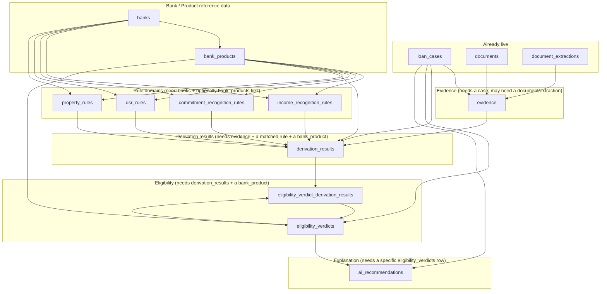

# Mortgage Knowledge Database PRD

Status: **Draft blueprint; CTO-approved for Sprint 6.3B-1 (Income Knowledge),
Sprint 6.3B-2 (Commitment Knowledge), Sprint 6.3B-3 (DSR Rules Knowledge), and
Sprint 6.3B-4 (Property Rules Knowledge) only, all of which have been
implemented (code authored, not executed) — see the "Sprint 6.3B-1
authorization", "Sprint 6.3B-2 authorization", "Sprint 6.3B-3 authorization",
and "Sprint 6.3B-4 authorization" updates in the Status section below. Every
remaining domain in this document (Eligibility Engine, AI Recommendation)
remains awaiting a separate CTO review before any further SQL or migration
work begins.**
Version: 1.0
Date: 2026-07-23
Author: supabase-architect (Sprint 6.3, Day 3 of the same scoping exercise)

Related:
[Mortgage Knowledge Base PRD](mortgage-knowledge-base-prd.md) (the 9 conceptual
models this document turns into tables) and
[Mortgage Knowledge Base — Technical & Architectural Design](mortgage-knowledge-architecture.md)
(the CTO-approved architecture baseline — Bank Knowledge Layer, Product Knowledge
Layer, Evidence Layer, Temporal Knowledge, Explainable AI Architecture, and the
11-concept ontology this document implements at the table level).

> Same discipline as both documents above, one level deeper: **no SQL, no
> `CREATE TABLE`, no DDL — not inline, not as an illustrative snippet, not as
> a separate file.** No file under `supabase/migrations/` is created or
> touched by this document. No application code is touched. Every table,
> column, relationship, and constraint below is described in **prose and
> markdown tables**; every diagram is Mermaid (`erDiagram` / `flowchart`) or
> ASCII. No real bank policy numbers (DSR caps, income haircuts, LTV/
> margin-of-finance limits) are invented here — every place one would
> eventually be needed is flagged, exactly as both prior documents flagged
> them. This document does not authorize a migration, an ADR committing to a
> specific technical approach, or any code or UI work.

## Why this document exists

The PRD named 9 conceptual models. The architecture doc turned them into 11
concepts across a 9-layer taxonomy, added the Evidence Layer, formalized
Temporal Knowledge, and designed an Explainable AI reasoning chain — all one
level above implementation, by explicit design. This document is the next,
still-pre-implementation layer: **if** a future, separately-approved Sprint
6.3B were to write real migrations, this is the blueprint it would work
from — every table, every column (in plain English, not SQL types), every
relationship, and the versioning/audit/soft-delete/seeding/naming decisions
those tables require. It does not initiate Sprint 6.3B, does not lift the
Phase 4 gate referenced in the PRD (`../ROADMAP.md`), and does not claim any
part of this design is approved for implementation.

---

## 1. Overall database architecture

This design does not introduce a second backend, a new database, or a new
authorization mechanism. Every table proposed below is a `public` schema
table in the same Supabase/Postgres project `loan_cases`, `documents`,
`mortgage_rules`, and everything else already lives in, following the same
architecture described in [../architecture/database.md](../architecture/database.md):
Postgres + Supabase Auth + Row Level Security as the sole authorization
boundary (no application-layer permission system, per
[0002](../decisions/0002-rls-as-sole-authorization-boundary.md) and
[../architecture/security.md](../architecture/security.md)). Every new table
below would need RLS enabled the moment it's created — that is a Sprint 6.3B
migration-authoring concern, not decided here, but the *principle* that RLS
is non-negotiable is stated now so no future migration draft is written
assuming otherwise.

### What's already live vs. what this document proposes

Of the architecture doc's 11 ontology concepts, exactly **one is fully live**
today, and this document proposes new tables for **9** of the remaining 10 —
deliberately not 10. The reason for that discrepancy is itself a design
decision this document is making explicitly, not an oversight:

| # | Ontology concept | Status | This document's position |
|---|---|---|---|
| 1 | Borrower Profile | Live, partially — 4 free-text columns (`nationality`, `income_country`, `employment_type`, `income_structure`) on `loan_cases`. | **No new table proposed.** Both the PRD and the architecture doc explicitly left open whether this should become a distinct (possibly one-to-many, for joint borrowers) entity, and neither resolved it. Proposing a new table here would silently resolve an open question this document isn't scoped to resolve. Every table below that needs a borrower-side reference (`evidence`, `derivation_results`, `eligibility_verdicts`) references `loan_cases` directly, exactly as `mortgage_rules` matching does today — see Section 10 for how this stays extensible if that question is later answered "yes, distinct entity." |
| 2 | Required Documents | **Fully live.** `mortgage_rules` → `mortgage_rule_documents` → `loan_case_required_documents`, matched in `src/lib/mortgage-rules/match-rule.ts`. | No changes proposed. The PRD/architecture doc's open question — should this become bank/product-scoped — is addressed as an extensibility seam in Section 10, not resolved here. |
| 3 | Evidence | Does not exist. | New table: `evidence` (Section 3). |
| 4 | Bank Policy (bank identity) | Does not exist — `bank_name` is free text. | New table: `banks` (Section 3). |
| 5 | Bank Product | Does not exist. | New table: `bank_products` (Section 3). |
| 6 | Income Recognition | Does not exist. | New table: `income_recognition_rules` (Section 3). |
| 7 | Commitment Recognition | Does not exist. | New table: `commitment_recognition_rules` (Section 3). |
| 8 | Property Rules | Does not exist. | New table: `property_rules` (Section 3). |
| 9 | DSR Rules | Does not exist. | New table: `dsr_rules` (Section 3). |
| 10 | Eligibility Engine | Does not exist. | New tables: `eligibility_verdicts`, plus the reasoning-chain support tables `derivation_results` and `eligibility_verdict_derivation_results` (Section 3). |
| 11 | AI Recommendation | Does not exist as a distinct model (only the ephemeral, never-stored "Next Action" field — [0008](../decisions/0008-ocr-and-ai-case-summary.md)). | New table: `ai_recommendations` (Section 3). |

Net: **11 new tables** are proposed. That number coincides with the
ontology's 11 concepts, but not 1:1 — Borrower Profile gets zero new tables
(deliberately), while Eligibility Engine gets three (one verdict table plus
two reasoning-chain support tables the Explainable AI Architecture, Section
6 of the architecture doc, requires) and Income/Commitment/Property/DSR
share one common result-snapshot table (`derivation_results`) rather than
four near-identical ones. Section 3 explains each choice.

### How this connects to what's already live

Every new table anchors back to the existing schema rather than duplicating
it:

- `evidence.loan_case_id` → `loan_cases.id` (existing) — every fact belongs
  to a case, the same anchor every existing case-scoped table uses.
- `evidence.source_document_id` → `documents.id` (existing) and
  `evidence.source_extraction_id` → `document_extractions.id` (existing,
  planned) — Evidence produced by OCR traces back to the exact document and
  extraction attempt that produced it, never a disconnected number.
- `income_recognition_rules` reuses the same four borrower-profile matching
  columns (`nationality`, `income_country`, `employment_type`,
  `income_structure`) and the same nullable-is-wildcard convention
  `mortgage_rules` already established — no new matching vocabulary is
  invented.
- `derivation_results.bank_product_id` and `eligibility_verdicts.bank_product_id`
  → `bank_products.id` (new) — the Eligibility Engine's unit of evaluation is
  a Bank Product, per the architecture doc's Section 3.
- Every `*_by_user_id` column → `user_profiles.id` (existing), matching the
  codebase's existing `uploaded_by_user_id` / `extracted_by_user_id` /
  `actor_user_id` naming (Section 9).

No existing table's columns are altered by this design except where the
PRD/architecture doc already flagged a dependency as a known gap (e.g.
`loan_cases` lacking `property_type`/`construction_status`/`occupancy_intent`
fields for Property Rules to evaluate against) — those gaps are not closed
here; they are out of scope for this document exactly as the PRD framed
them, and would need their own scoping pass before Sprint 6.3B could
actually reference them from `evidence` or `derivation_results`.

---

## 2. Complete ERD

```mermaid
erDiagram
    loan_cases ||--o{ evidence : "has"
    loan_cases ||--o{ derivation_results : "computed for"
    loan_cases ||--o{ eligibility_verdicts : "computed for"
    loan_cases ||--o{ ai_recommendations : "explained for"

    documents ||--o{ evidence : "may source (OCR)"
    document_extractions ||--o{ evidence : "may source (specific OCR attempt)"
    document_types ||--o{ documents : "categorizes (existing)"

    user_profiles ||--o{ evidence : "captured_by"
    user_profiles ||--o{ derivation_results : "computed_by"
    user_profiles ||--o{ eligibility_verdicts : "requested_by"
    user_profiles ||--o{ ai_recommendations : "requested_by"

    banks ||--o{ bank_products : "offers"
    banks ||--o{ income_recognition_rules : "scopes (bank-wide default)"
    banks ||--o{ commitment_recognition_rules : "scopes (bank-wide default)"
    banks ||--o{ dsr_rules : "scopes (bank-wide default)"
    banks ||--o{ property_rules : "scopes (bank-wide default)"

    bank_products ||--o{ income_recognition_rules : "overrides (most-specific)"
    bank_products ||--o{ commitment_recognition_rules : "overrides (most-specific)"
    bank_products ||--o{ dsr_rules : "overrides (most-specific)"
    bank_products ||--o{ property_rules : "overrides (most-specific)"
    bank_products ||--o{ derivation_results : "evaluated for"
    bank_products ||--o{ eligibility_verdicts : "evaluated against"

    evidence ||--o{ derivation_results : "feeds (input evidence)"

    income_recognition_rules ||--o{ derivation_results : "produces (domain=income_recognition)"
    commitment_recognition_rules ||--o{ derivation_results : "produces (domain=commitment_recognition)"
    property_rules ||--o{ derivation_results : "produces (domain=property_rules)"
    dsr_rules ||--o{ derivation_results : "produces (domain=dsr)"

    derivation_results ||--o{ eligibility_verdict_derivation_results : "contributes to"
    eligibility_verdicts ||--o{ eligibility_verdict_derivation_results : "aggregates"
    eligibility_verdicts ||--o{ ai_recommendations : "is explained by"

    loan_cases {
        identifier id PK
        text case_number
        text nationality "existing Borrower Profile field"
        text income_country "existing Borrower Profile field"
        text employment_type "existing Borrower Profile field"
        text income_structure "existing Borrower Profile field"
    }
    documents {
        identifier id PK
        reference loan_case_id FK
        reference document_type_id FK
    }
    document_extractions {
        identifier id PK
        reference document_id FK
        text kind
        json extracted_data
    }
    evidence {
        identifier id PK
        reference loan_case_id FK
        text evidence_type
        json value
        text source_type
        reference source_document_id FK
        reference source_extraction_id FK
        reference captured_by_user_id FK
        timestamp captured_at
        reference superseded_by_evidence_id FK
    }
    banks {
        identifier id PK
        text name
        text short_code
        boolean is_active
        date effective_from
        date effective_to
    }
    bank_products {
        identifier id PK
        reference bank_id FK
        text product_name
        text financing_structure
        boolean is_active
        date effective_from
        date effective_to
    }
    income_recognition_rules {
        identifier id PK
        reference bank_id FK
        reference bank_product_id FK
        text income_source_type
        text nationality
        text employment_type
        text income_structure
        text recognition_method
        decimal haircut_percentage
        integer averaging_window_months
        integer version
        boolean is_active
        date effective_from
        date effective_to
    }
    commitment_recognition_rules {
        identifier id PK
        reference bank_id FK
        reference bank_product_id FK
        text commitment_type
        text recognition_method
        decimal recognition_percentage
        boolean allows_to_be_settled_exclusion
        integer version
        boolean is_active
    }
    dsr_rules {
        identifier id PK
        reference bank_id FK
        reference bank_product_id FK
        decimal max_dsr_percentage
        decimal stress_test_rate_buffer_percentage
        integer version
        boolean is_active
    }
    property_rules {
        identifier id PK
        reference bank_id FK
        reference bank_product_id FK
        text property_type
        text construction_status
        text occupancy_intent
        decimal margin_of_finance_percentage
        integer max_tenure_years
        integer version
        boolean is_active
    }
    derivation_results {
        identifier id PK
        reference loan_case_id FK
        reference bank_product_id FK
        text domain
        identifier rule_id "polymorphic, see Section 3"
        integer rule_version
        json result_value
        timestamp computed_at
        reference computed_by_user_id FK
    }
    eligibility_verdicts {
        identifier id PK
        reference loan_case_id FK
        reference bank_product_id FK
        text verdict
        json reasons
        timestamp computed_at
        reference requested_by_user_id FK
    }
    eligibility_verdict_derivation_results {
        identifier id PK
        reference eligibility_verdict_id FK
        reference derivation_result_id FK
    }
    ai_recommendations {
        identifier id PK
        reference loan_case_id FK
        reference eligibility_verdict_id FK
        text recommendation_text
        text model_name
        timestamp generated_at
        reference requested_by_user_id FK
    }
```

`loan_cases`, `documents`, `document_types`, `document_extractions`, and
`user_profiles` are shown abbreviated — only the columns this design touches
are listed; see [../architecture/database.md](../architecture/database.md)
for their full existing shape.

---

## 3. Every required table

Eleven new tables, grouped by the ontology concept(s) each implements. Types
below are plain-English descriptions, not SQL types — "text", "decimal",
"integer", "boolean", "date", "timestamp", "json", "identifier" (a unique
row identifier), and "reference to X" (a foreign key to another table's
identifier).

### 3.1 `evidence`

**Implements**: Evidence (architecture doc Section 4).

**Purpose**: a normalized fact record, decoupled from its origin — the
shared shape every Derivation Knowledge rule (Income Recognition,
Commitment Recognition, Property Rules) evaluates, regardless of whether the
fact came from OCR, manual entry, customer self-declaration, or a future
source. Append-only: a correction is always a new row, never an edit (see
Section 7).

| Column | Type | Description |
|---|---|---|
| `id` | identifier | Primary key. |
| `loan_case_id` | reference to `loan_cases` | Which case this fact belongs to. |
| `evidence_type` | text | What kind of fact this is (e.g. "recognized_raw_income", "existing_commitment_instalment", "property_type"). Open vocabulary maintained by application-layer convention, not a database enum — same posture as `loan_cases.income_structure` today — so a new evidence type never requires a migration. |
| `value` | json | The normalized fact itself — a plain number for a figure (e.g. a salary amount) or a small structured object for a qualitative attribute (e.g. property type plus construction status). Shaped for what a Derivation Knowledge rule needs, not a raw provider payload. |
| `source_type` | text | Where this fact came from: "ocr", "manual_entry", "customer_declaration", or a future value (e.g. a future credit-bureau integration). Open vocabulary for the same reason as `evidence_type` — a new origin is a new value, never a schema change (architecture doc Section 4's core design goal). |
| `source_document_id` | reference to `documents`, nullable | The uploaded document this fact was extracted from, when `source_type` is "ocr". |
| `source_extraction_id` | reference to `document_extractions`, nullable | The specific OCR attempt that produced this fact — tighter provenance than the document alone. |
| `source_note` | text, nullable | Free-text context for non-document origins, e.g. "declared by borrower during intake call". |
| `captured_by_user_id` | reference to `user_profiles`, nullable | Who or what produced this Evidence. |
| `captured_at` | timestamp | When this fact was captured. |
| `superseded_by_evidence_id` | reference to `evidence`, nullable, self-referencing | If a later fact corrects this one (e.g. a re-OCR), points at the newer row. The corrected row is never edited or removed. |

### 3.2 `banks`

**Implements**: Bank Policy — the bank identity anchor (architecture doc
Section 2).

**Purpose**: the structured replacement for today's unconstrained free-text
`bank_name` (`loan_cases`, `bankers`) — the canonical bank identity every
bank-scoped rule domain anchors to.

| Column | Type | Description |
|---|---|---|
| `id` | identifier | Primary key. |
| `name` | text | Canonical bank name. Unique. |
| `short_code` | text, nullable | Optional internal reference/code. |
| `is_active` | boolean, default true | Deactivate a bank AIKIM no longer works with, rather than delete it, so historical cases referencing it remain explainable. |
| `effective_from` | date, nullable | Standard Temporal Knowledge trio (Section 5). |
| `effective_to` | date, nullable | |
| `created_at` / `updated_at` | timestamp | |

### 3.3 `bank_products`

**Implements**: Bank Product (architecture doc Section 3).

**Purpose**: a specific mortgage product offered by a bank — the actual unit
the Eligibility Engine evaluates a case against, per the architecture doc's
Section 3 resolution ("the Eligibility Engine's unit of evaluation is a Bank
Product, not a Bank").

| Column | Type | Description |
|---|---|---|
| `id` | identifier | Primary key. |
| `bank_id` | reference to `banks` | The one bank this product belongs to. |
| `product_name` | text | E.g. a conventional vs. an Islamic financing product name — no real product names asserted here. |
| `product_code` | text, nullable | Optional internal reference/code. |
| `financing_structure` | text, nullable | Open vocabulary (e.g. conventional/Islamic); no real classification scheme asserted here. |
| `is_active` | boolean, default true | A bank retiring a product deactivates it, never deletes it. |
| `effective_from` / `effective_to` | date, nullable | |
| `created_at` / `updated_at` | timestamp | |

### 3.4 `income_recognition_rules`

**Implements**: Income Recognition (Derivation Knowledge).

**Purpose**: converts a raw income Evidence fact into a recognized figure
usable by DSR, scoped to a bank (and optionally overridden per product) and
to a borrower-profile combination, reusing the exact wildcard/most-specific
matching `mortgage_rules` already implements.

| Column | Type | Description |
|---|---|---|
| `id` | identifier | Primary key. |
| `bank_id` | reference to `banks` | Every rule is scoped to a bank; required. |
| `bank_product_id` | reference to `bank_products`, nullable | Null = bank-wide default (wildcard). A specific value overrides the bank default for that product only — most-specific-wins, same algorithm as `src/lib/mortgage-rules/match-rule.ts`. |
| `rule_name` | text | Admin label. |
| `income_source_type` | text | Which income type this rule treats: basic salary, fixed allowance, commission, bonus, overtime, rental income, business/self-employed income, EPF/dividend income, other. |
| `nationality` | text, nullable | Wildcard-if-null borrower-profile matching column, reusing the exact convention `mortgage_rules` already ships. |
| `income_country` | text, nullable | Same convention. |
| `employment_type` | text, nullable | Same convention. |
| `income_structure` | text, nullable | Same convention. |
| `recognition_method` | text | "full_value", "percentage_haircut", or "rolling_average" — the three treatment shapes the PRD named. No numeric value is asserted by the method name itself. |
| `haircut_percentage` | decimal, nullable | Populated only when `recognition_method` = "percentage_haircut". No real percentage is seeded by this document — requires real bank policy input. |
| `averaging_window_months` | integer, nullable | Populated only when `recognition_method` = "rolling_average". |
| `minimum_history_months` | integer, nullable | Minimum documented history required before this income source is recognized at all — ties back to Required Documents (e.g. "3 months of salary slips" as a prerequisite, not just a document to collect). |
| `description` | text, nullable | Free-text admin note. |
| `version` | integer, default 1 | Same purpose as `mortgage_rules.version` — increments when a rule's matching profile changes after it has been used, so historical `derivation_results` references stay interpretable. |
| `is_active` | boolean, default true | Deactivate-only governance (Section 5, Section 7). |
| `effective_from` / `effective_to` | date, nullable | |
| `created_at` / `updated_at` | timestamp | |

### 3.5 `commitment_recognition_rules`

**Implements**: Commitment Recognition (Derivation Knowledge).

**Purpose**: the bank-specific treatment applied to a borrower's existing
commitment Evidence, for DSR purposes.

| Column | Type | Description |
|---|---|---|
| `id` | identifier | Primary key. |
| `bank_id` | reference to `banks` | Required. |
| `bank_product_id` | reference to `bank_products`, nullable | Null = bank-wide default; same wildcard/most-specific pattern. |
| `rule_name` | text | Admin label. |
| `commitment_type` | text | Housing loan, hire purchase/car loan, personal loan, credit card, other. |
| `recognition_method` | text | E.g. "full_instalment", "percentage_of_limit" (a real Malaysian credit-card underwriting convention) — the method name only; no real percentage asserted. |
| `recognition_percentage` | decimal, nullable | Populated only when `recognition_method` requires one. Not seeded with a real figure here. |
| `allows_to_be_settled_exclusion` | boolean, default false | Whether this bank allows excluding a commitment the borrower states will be settled before/at drawdown. |
| `description` | text, nullable | |
| `version` | integer, default 1 | Same purpose as `mortgage_rules.version`. |
| `is_active` | boolean, default true | |
| `effective_from` / `effective_to` | date, nullable | |
| `created_at` / `updated_at` | timestamp | |

### 3.6 `dsr_rules`

**Implements**: DSR Rules (Computation Knowledge).

**Purpose**: the DSR formula and threshold for a bank/product.

| Column | Type | Description |
|---|---|---|
| `id` | identifier | Primary key. |
| `bank_id` | reference to `banks` | Required. |
| `bank_product_id` | reference to `bank_products`, nullable | Wildcard/most-specific, same pattern. |
| `rule_name` | text | |
| `max_dsr_percentage` | decimal, nullable | The maximum ratio this bank/product allows. Not populated with a real figure by this document — requires real bank policy input. |
| `stress_test_rate_buffer_percentage` | decimal, nullable | An interest-rate buffer applied to the proposed instalment before computing the numerator, if this bank practices it. Not asserted here. |
| `income_tier_lower_bound` / `income_tier_upper_bound` | decimal, nullable | For income-tier-based threshold variation, if any bank applies it. Not asserted here. **Implemented as a half-open numeric range test** (`lower IS NULL OR income >= lower` AND `upper IS NULL OR income < upper`), not a wildcard-equality match — see Sprint 6.3B-3's implementation note below and [0012](../decisions/0012-dsr-knowledge-implementation.md). |
| `description` | text, nullable | |
| `version` | integer, default 1 | |
| `is_active` | boolean, default true | |
| `effective_from` / `effective_to` | date, nullable | |
| `created_at` / `updated_at` | timestamp | |

### 3.7 `property_rules`

**Implements**: Property Rules (Derivation Knowledge).

**Purpose**: margin-of-finance, tenure, and eligibility constraints that vary
by the property being financed, per bank/product.

| Column | Type | Description |
|---|---|---|
| `id` | identifier | Primary key. |
| `bank_id` | reference to `banks` | Required. |
| `bank_product_id` | reference to `bank_products`, nullable | Wildcard/most-specific, same pattern. |
| `rule_name` | text | |
| `property_type` | text | Residential, commercial, land, other. |
| `construction_status` | text | Completed vs. under construction/progressive drawdown. |
| `occupancy_intent` | text | Owner-occupied vs. investment. |
| `existing_property_count_min` / `existing_property_count_max` | integer, nullable | The range of the borrower's existing financed-property count this rule applies to. |
| `margin_of_finance_percentage` | decimal, nullable | Not populated with a real figure here. |
| `max_tenure_years` | integer, nullable | Not populated with a real figure here. |
| `description` | text, nullable | |
| `version` | integer, default 1 | |
| `is_active` | boolean, default true | |
| `effective_from` / `effective_to` | date, nullable | |
| `created_at` / `updated_at` | timestamp | |

### 3.8 `derivation_results`

**Implements**: the computation-time *output* of Income Recognition,
Commitment Recognition, Property Rules, and DSR Rules (Derivation and
Computation Knowledge) — the reasoning-chain support table the architecture
doc's Explainable AI Architecture (Section 6) requires ("every rule-domain
result... needs a reference to the exact rule version that produced it").

**Purpose**: an append-only, computation-time snapshot of a single
derivation output for a specific case and Bank Product, together with a
reference to the exact rule row and version that produced it. One shared
table across all four domains, rather than four near-identical result
tables — the same "one shared shape regardless of origin" discipline the
Evidence Layer applies to raw facts, applied one layer up to derived facts.

| Column | Type | Description |
|---|---|---|
| `id` | identifier | Primary key. |
| `loan_case_id` | reference to `loan_cases` | |
| `bank_product_id` | reference to `bank_products` | Which product this result was computed for. |
| `domain` | text | "income_recognition", "commitment_recognition", "property_rules", or "dsr". |
| `rule_id` | identifier | The specific rule row that produced this result — in `income_recognition_rules`, `commitment_recognition_rules`, `property_rules`, or `dsr_rules`, depending on `domain`. **Design note, not decided here**: this is a polymorphic reference across four possible target tables; Postgres cannot express one foreign-key constraint pointing at four different tables. Sprint 6.3B would need to choose between four nullable domain-specific reference columns (one populated depending on `domain`) or an unenforced reference validated at the application layer, mirroring the discipline already used for `mortgage_rules`' matcher living in TypeScript rather than SQL. Flagged, not resolved. |
| `rule_version` | integer | A snapshot copy of the matched rule's `version` at computation time, kept redundantly so the chain stays reconstructable even without a join. |
| `input_evidence_ids` | a set of references to `evidence` rows | Which Evidence fact(s) this result was computed from. Represented conceptually as an array/join; exact shape (a jsonb array of ids vs. a separate join table) is a Sprint 6.3B decision. |
| `result_value` | json | The computed output — a recognized income amount, a recognized commitment instalment, a DSR ratio, or a margin-of-finance/tenure ceiling; shape varies by `domain`. |
| `computed_at` | timestamp | |
| `computed_by_user_id` | reference to `user_profiles`, nullable | Who triggered this computation — nullable because a system recomputation may have no acting user. |

### 3.9 `eligibility_verdicts`

**Implements**: Eligibility Engine (Decision Knowledge, including "Bank
Matching").

**Purpose**: the per-case, per-Bank-Product eligibility verdict, persisted
as a frozen, computation-time snapshot rather than recomputed live — see
Section 6 for why this document takes that position and flags it as a
recommendation, not a silently-assumed fact.

| Column | Type | Description |
|---|---|---|
| `id` | identifier | Primary key. |
| `loan_case_id` | reference to `loan_cases` | |
| `bank_product_id` | reference to `bank_products` | The specific product evaluated — the Eligibility Engine's unit of evaluation, per architecture doc Section 3. |
| `verdict` | text | "eligible", "not_eligible", or "eligible_with_conditions". |
| `reasons` | json | Structured, human-readable list of reasons, so a rejection or condition traces to a specific rule, not an opaque score. |
| `computed_at` | timestamp | |
| `requested_by_user_id` | reference to `user_profiles`, nullable | |

### 3.10 `eligibility_verdict_derivation_results`

**Implements**: the reasoning-chain join between Eligibility Engine and the
Derivation/Computation Knowledge results that fed it.

**Purpose**: links one `eligibility_verdicts` row to every
`derivation_results` row that contributed to it (the Income Recognition,
Commitment Recognition, DSR, and Property Rules results actually used) — the
literal, queryable reasoning chain the architecture doc's Explainable AI
Architecture (Section 6) requires.

| Column | Type | Description |
|---|---|---|
| `id` | identifier | Primary key. |
| `eligibility_verdict_id` | reference to `eligibility_verdicts` | |
| `derivation_result_id` | reference to `derivation_results` | |

### 3.11 `ai_recommendations`

**Implements**: AI Recommendation (Explanation Knowledge).

**Purpose**: the natural-language explanation of one specific,
already-computed `eligibility_verdicts` row — never a live recomputation,
per the PRD's model 9 attribute list and
[0008](../decisions/0008-ocr-and-ai-case-summary.md)'s existing precedent.

| Column | Type | Description |
|---|---|---|
| `id` | identifier | Primary key. |
| `loan_case_id` | reference to `loan_cases` | |
| `eligibility_verdict_id` | reference to `eligibility_verdicts` | The specific verdict instance being explained — a versioned reference, never a live query, per the PRD. |
| `recommendation_text` | text | The generated recommendation. |
| `model_name` | text | E.g. "gemini-2.5-pro" — same purpose as `document_extractions.model_name`, recorded per generation so a future provider swap does not lose history of which model produced which text. |
| `generated_at` | timestamp | |
| `requested_by_user_id` | reference to `user_profiles`, nullable | Generated on request only, like today's Next Action field — never automatic, never silently cached. |

---

## 4. Relationships

- **`banks` → `bank_products` is one-to-many.** A bank offers zero or more
  products; a product belongs to exactly one bank.
- **A Derivation rule (`income_recognition_rules`, `commitment_recognition_rules`,
  `dsr_rules`, `property_rules`) is scoped to a `bank_id`, with an optional
  `bank_product_id` override — wildcard/most-specific-wins, exactly as
  `src/lib/mortgage-rules/match-rule.ts` already implements.** A rule with
  `bank_product_id = null` is that bank's default treatment; a rule with a
  specific `bank_product_id` overrides the default for that product only.
  Among every matching rule for a given bank/product/borrower-profile
  combination, the one with the fewest wildcards (nulls) across its scoping
  and matching columns wins — the same algorithm, applied to one more
  dimension (bank/product) than it matches on today. No new matching
  mechanism is proposed; Sprint 6.3B, if approved, would extend
  `match-rule.ts`'s existing function (or a close sibling of it) rather than
  invent a second one. **Exception, added at Sprint 6.3B-3**: `dsr_rules`'
  third matching dimension (`income_tier_lower_bound`/`income_tier_upper_bound`)
  is a numeric range test, not a wildcard-equality dimension — see Section
  3.6 and [0012](../decisions/0012-dsr-knowledge-implementation.md). The
  "fewest wildcards wins" algorithm as originally described applies to
  `bank_id`/`bank_product_id` scoping for every rule table including
  `dsr_rules`; it does not by itself describe how the income-tier range
  participates in specificity ordering — that is left to the future
  `src/lib/dsr-knowledge/match-dsr-rule.ts` implementation, not resolved
  here.
- **`evidence` belongs to a `loan_case`, optionally traces to a `document`
  and a `document_extraction`.** A single loan case has many Evidence rows,
  accumulated over the life of the case as documents are OCR'd or facts are
  manually entered.
- **`derivation_results` consumes `evidence` and references exactly one
  rule row (across four possible domain tables) plus the `bank_product`
  it was computed for.** One case × one bank product can have many
  `derivation_results` rows over time (Income Recognition for each income
  source, Commitment Recognition for each commitment, one Property Rules
  result, one DSR result) — and the same case × bank product pair
  accumulates a *new* set every time it's recomputed (e.g. after new
  documents arrive), never overwriting the prior set.
- **`eligibility_verdicts` is the aggregation point.** One verdict row per
  case × Bank Product × computation, referencing the full set of
  `derivation_results` rows that contributed to it via
  `eligibility_verdict_derivation_results` — a genuine many-to-many, since
  one verdict aggregates several derivation results, and (across
  computations over time) one derivation result could in principle inform
  more than one verdict run if reused, though in practice each computation
  would typically produce its own fresh set.
- **`ai_recommendations` references exactly one `eligibility_verdicts` row.**
  Many-to-one: a single verdict can be explained more than once (a banker
  regenerating a recommendation), but every recommendation traces to exactly
  one verdict instance — never to raw Borrower Profile, Evidence, or
  Derivation Knowledge data directly. This is the database-level enforcement
  of the architecture doc's "every arrow into AI Recommendation passes
  through Eligibility Engine, never around it" (Section 6).
- **Existing tables are referenced, never duplicated.** `loan_cases`,
  `documents`, `document_extractions`, and `user_profiles` are the only
  existing tables any new table points at; no new table re-stores a case
  number, a document's file metadata, or a user's role.

---

## 5. Versioning strategy

Every rule table proposed in Section 3 — `banks`, `bank_products`,
`income_recognition_rules`, `commitment_recognition_rules`, `dsr_rules`,
`property_rules` — carries the same trio `mortgage_rules` already ships:
`is_active` (boolean, default true), `effective_from` (date, nullable),
`effective_to` (date, nullable), and (for the four rule-content tables) a
`version` integer, exactly formalizing the architecture doc's Temporal
Knowledge principle (Section 5):

- **A policy change is a new row, never an edit to the old one.** A bank
  changing its DSR cap, an income haircut percentage changing, a
  margin-of-finance limit tightening — each is authored as a new
  `dsr_rules`/`income_recognition_rules`/`property_rules` row (a new
  `version`, its own `effective_from`), not a mutation of the row that
  represented the prior policy. Bank identity (`banks`) and product identity
  (`bank_products`) follow the same `is_active`/`effective_from`/
  `effective_to` shape without a `version` column — a bank or product is an
  entity being deactivated, not a policy value being revised, so a discrete
  version counter adds no information there `mortgage_rules`' own pattern
  doesn't distinguish deactivation from re-versioning either.
- **Evaluation always uses the version effective at the relevant date, not
  "whatever's current."** This is an application/matching-layer
  responsibility (mirroring `match-rule.ts`), not something the schema
  enforces by itself — the schema's job is to make every version
  independently queryable and never overwritten, so the matching logic
  *can* pick the right one.
- **An Eligibility verdict records which version of each contributing rule
  was used, not just the current rule.** This is what
  `derivation_results.rule_id` + `derivation_results.rule_version` are
  for (Section 3.8): every derivation output stores a durable pointer to the
  exact rule row (and a redundant copy of its version number) that produced
  it, and `eligibility_verdict_derivation_results` (Section 3.10) links a
  verdict to every one of those derivation outputs. A verdict computed in
  March, referencing a DSR cap active at that time, stays fully
  reconstructable in July even after the bank raises or lowers that cap in
  June — the exact requirement the architecture doc's Section 6
  (Explainable AI Architecture) names.

---

## 6. Audit strategy

This codebase already has two distinct patterns, and this design uses one
of them consistently — never `audit_logs` — for every new table:

| Pattern | Where it's used today | Visibility | Applies to |
|---|---|---|---|
| `audit_logs` | Trigger-populated, generic change log. | `super_admin`-only read (RLS). | **None of the tables in this design.** Knowledge Base tables are working data for the staff running a case (bankers, agents), not an admin-only audit trail — the same reasoning `loan_case_timeline_events` already used to deliberately *not* reuse `audit_logs` ("this timeline must be visible to the banker working the case, not just an admin"). |
| Purpose-built, append-only event/fact tables | `document_extractions` (every OCR attempt kept), `loan_case_required_document_events` (every checklist transition kept), `loan_case_timeline_events` (every explicit case event kept). | Visible to any case-working staff role, scoped via the same `EXISTS`-against-`loan_cases` pattern every case-scoped table already uses. | **Every new table in this design**: `evidence`, `derivation_results`, `eligibility_verdicts`, `eligibility_verdict_derivation_results`, and `ai_recommendations` are all designed append-only for exactly this reason — each insert *is* the audit record, there is nothing to separately log. |

For the six rule/policy tables (`banks` through `property_rules`), the audit
trail is the versioning pattern itself (Section 5) — deactivating a rule and
authoring a new version is the auditable event; who authored which version,
and when, is `created_at`/`updated_at` plus (for a future admin UI, not
designed here) whatever actor-tracking columns Sprint 6.3B adds, following
the same posture Phase 2 of the mortgage rules admin work established
([0007](../decisions/0007-mortgage-rule-admin.md)).

### Position on the persistence-vs-recompute tension (recommendation, not a decision)

The architecture doc's Section 6 explicitly surfaces, but does not resolve,
whether Eligibility verdicts (and their contributing Derivation/Computation
results) need to be *persisted* as frozen, computation-time snapshots,
rather than recomputed live on every read. **This document's position:
persist them.** `eligibility_verdicts` and `derivation_results` are designed
above as append-only fact tables, not as mutable "current state" — every
computation writes a new row, and a historical verdict is read back exactly
as it was computed, never silently reinterpreted against today's rules.

The reasoning: `CLAUDE.md`'s auditability principle ("every state change
should be traceable to who did it and when") applies as much to a DSR/
eligibility computation touching real lending decisions as it does to a
document upload or a status change — arguably more, given the PRD and
architecture doc both flag this as the most sensitive model in the whole
Knowledge Base. A recompute-on-read design would make a verdict shown to a
banker in March silently different if viewed again in July after a bank
policy change, with no record that anything changed — the exact failure
mode Section 5 (Temporal Knowledge) and Section 6 (Explainable AI
Architecture) of the architecture doc both warn against. Persisting is also
the only way `ai_recommendations.eligibility_verdict_id` can mean "the
specific verdict instance being explained" (the PRD's own model 9
requirement) rather than "whatever the live query currently returns."

**This is a recommendation this document is making, not a silently assumed
fact** — the CTO should confirm it before Sprint 6.3B, since it has real
consequences (storage growth from every recomputation, and a data-retention
policy question this document does not address: how long persisted verdicts
are kept, and who can read old ones, beyond the RLS visibility rule already
stated above).

---

## 7. Soft delete strategy

The CTO's "soft delete" maps directly onto what this codebase already calls
**deactivate-only, no DELETE RLS policy at all** — not merely an application
convention but a database-level guarantee, exactly as `mortgage_rules`
already enforces (see [../architecture/security.md](../architecture/security.md):
"`mortgage_rules` has no DELETE RLS policy at all — not even `super_admin`
can hard-delete a rule through the database, only deactivate it.").

**Gets deactivate-only treatment (soft delete via `is_active`)**: the six
versioned policy/rule tables — `banks`, `bank_products`,
`income_recognition_rules`, `commitment_recognition_rules`, `dsr_rules`,
`property_rules`. Each of these, if a future migration follows
`mortgage_rules`' precedent, would ship with **no DELETE RLS policy at
all** — a `super_admin` (or future rule-admin surface) deactivates a bank,
retires a product, or supersedes a rule version; nothing is ever hard-deleted
at the database level, so a case evaluated last year against a
now-deactivated bank/product/rule stays explainable.

**Genuinely append-only, no soft-delete concept applies at all**: `evidence`,
`derivation_results`, `eligibility_verdicts`,
`eligibility_verdict_derivation_results`, and `ai_recommendations`. These
tables have no "active/inactive" state to toggle in the first place — every
row is a fact about what happened at a point in time (a captured Evidence
value, a computed derivation result, a computed verdict, a generated
recommendation). Nothing is ever "deleted," soft or hard; a correction is
always expressed as a new row (e.g. `evidence.superseded_by_evidence_id`
pointing forward), and the old row remains exactly as it was. This mirrors
`document_extractions` and `loan_case_required_document_events` exactly —
neither of those tables has a DELETE policy either, and neither has an
`is_active` column, because "soft delete" isn't a meaningful operation on an
append-only fact log.

---

## 8. Seeder strategy

### The existing pattern, and whether it should continue (recommendation)

Every piece of reference data in this codebase so far — `document_categories`,
`document_types`, `mortgage_rules`, `mortgage_rule_documents` — has shipped
**human-curated via the Supabase SQL Editor, zero rows shipped by a
migration** (see [../product/roadmap.md](../product/roadmap.md) Sprint 6.2
Phase 1/2: "Phase 2 ships zero seeded rules by design; every case shows 'no
rule matched' until a super_admin authors real ones"). This document
**recommends continuing that pattern** for `banks`, `bank_products`, and the
four rule domains at the outset — no migration should insert fabricated
bank/product/rule rows, for the same reason `mortgage_rules` shipped empty:
inventing plausible-looking bank policy data would be indistinguishable
from real policy to whoever reads it later, and this project's discipline
("real data only," per `CLAUDE.md`) treats that as a compliance risk, not a
convenience.

**One flag for Sprint 6.3B to weigh, not a decision made here**: this
Knowledge Base's reference data has materially higher cardinality than
`mortgage_rules` did — a bank × its products × four rule domains × versions,
compounding multiplicatively rather than `mortgage_rules`' single flat
dimension. The SQL-Editor-only posture worked well at `mortgage_rules`' Phase
1 scale (tens of rows); it may become a real usability bottleneck sooner
here, once even two or three real banks are onboarded. This document
recommends the same admin-UI trajectory `mortgage_rules` itself followed
(Phase 1: SQL Editor only → Phase 2: `super_admin`-only admin UI, per
[0007](../decisions/0007-mortgage-rule-admin.md)), but flags that the gap
between those two phases should likely be shorter here than it was for
`mortgage_rules` — a recommendation for whoever scopes Sprint 6.3B and
beyond, not a decision this document is making.

### Illustrative first real seed (NOT executed, NOT SQL, conceptual only)

The CTO has separately approved, as a Priority 2 item (not yet executed —
blocked on Priority 1 sequencing and this scoping work), seeding exactly one
real Required Documents rule: **Malaysian nationality, Malaysian income
country, Employed, Basic Salary income structure**, requiring NRIC, Salary
Slip, EPF, and Bank Statement. That seed uses tables that already exist
(`mortgage_rules`, `mortgage_rule_documents`) and is unaffected by this
document. Using the same borrower profile as a concrete illustration, here
is what an analogous **first real seed for the new tables in this design**
would conceptually contain, described in prose and a table — not SQL, and
not asserting any of these are real, confirmed bank policies:

| Table | What a first real row would conceptually contain |
|---|---|
| `banks` | One row for a real bank AIKIM actually works with (e.g. its legal/trading name), `is_active = true`. |
| `bank_products` | One row for that bank's baseline home financing product, `bank_id` pointing at the row above, `is_active = true`. |
| `income_recognition_rules` | One row scoped to that `bank_id` (product left null, i.e. this bank's default treatment), matching `nationality = "Malaysian"`, `employment_type = "Employed"`, `income_structure = "Basic Salary"` (the same profile the Required Documents seed uses), `income_source_type = "basic_salary"`, `recognition_method = "full_value"` (deliberately the one method that requires no invented percentage — a safe, illustratively concrete choice that doesn't cross the "no real bank policy numbers" line), `minimum_history_months = 3` (mirroring the Required Documents seed's own "3 months of salary slips" requirement, so the two seeds are consistent with each other, not asserting this is confirmed bank policy). |

This single conceptual example deliberately reuses the same borrower profile
and the same "3 months" documentation expectation the already-approved
Required Documents seed uses, so a future migration author has a coherent,
cross-referenced starting point rather than two unrelated example seeds.

---

## 9. Naming conventions

Extracted from `docs/architecture/database.md` and the migration files under
`supabase/migrations/`, and applied consistently to every table in Section
3:

| Convention | Existing example | Applied in this design |
|---|---|---|
| `snake_case` for every table and column. | `loan_case_required_documents`, `document_type_id` | Every table/column proposed above. |
| `<parent>_<concept>` for join/dependent tables, singular parent. | `mortgage_rule_documents` (parent: `mortgage_rules`, singular `mortgage_rule`), `loan_case_required_documents` (parent: `loan_cases`, singular `loan_case`) | `eligibility_verdict_derivation_results` (parent: `eligibility_verdicts`, singular `eligibility_verdict`). |
| `_events` suffix reserved for append-only audit-trail *companion* tables to a mutable current-state table. | `loan_case_required_document_events` (companion to the mutable `loan_case_required_documents.state`) | **Not used anywhere in this design** — `evidence`, `derivation_results`, `eligibility_verdicts`, and `ai_recommendations` have no mutable current-state counterpart to be a companion to; each *is* its own append-only log (Section 6, Section 7), so no `_events` table is proposed. |
| `is_active` / `effective_from` / `effective_to` as the standard versioning trio, plus `version` for rule-content tables. | `mortgage_rules` | `banks`, `bank_products` (trio only), `income_recognition_rules`, `commitment_recognition_rules`, `dsr_rules`, `property_rules` (trio plus `version`). |
| Explicit `<verb>_by_user_id`-style foreign keys, never a bare `<verb>_by`, referencing `user_profiles.id`. | `uploaded_by_user_id`, `extracted_by_user_id`, `actor_user_id` | `captured_by_user_id` (`evidence`), `computed_by_user_id` (`derivation_results`), `requested_by_user_id` (`eligibility_verdicts`, `ai_recommendations`). |
| `<table>_id` for a straightforward foreign key to another table's primary key. | `loan_case_id`, `document_type_id`, `mortgage_rule_id` | `bank_id`, `bank_product_id`, `eligibility_verdict_id`, `derivation_result_id`, `source_document_id`, `source_extraction_id`. |
| Reference/lookup data gets a `select`-only RLS posture for authenticated users at first, writes added later by a dedicated admin migration. | `document_categories`, `mortgage_rules` (Phase 1 read-only, Phase 2 adds `super_admin` writes). | Recommended, not decided, for `banks`/`bank_products`/the four rule tables in a future Sprint 6.3B — consistent with Section 8's recommendation. |

A future migration author should not need to guess at any of these — every
table name, column name, and RLS posture proposed in Section 3 follows one
of the rows above.

---

## 10. Future extensibility

Three things both prior documents explicitly flagged as **not decided** are
addressed here as seams this design leaves open, not redesigns it requires:

- **Whether Required Documents becomes bank/product-scoped.** Neither the
  PRD nor the architecture doc resolved this (the architecture doc's
  ontology diagram shows it as a dashed, unresolved edge). This design does
  not touch `mortgage_rules`/`mortgage_rule_documents` at all — but because
  `banks` and `bank_products` now exist as real reference tables (Section
  3.2, 3.3) once this design ships, answering that question later would be
  an *additive* change: nullable `bank_id`/`bank_product_id` columns on
  `mortgage_rules`, reusing the exact wildcard/most-specific matching this
  design already uses everywhere else — not a new concept, not a schema
  rebuild.
- **Commitment Recognition's future CCRIS/CTOS integration.** Explicitly out
  of scope for both prior documents. This design does not need to change to
  accommodate it later, by construction: a CCRIS/CTOS-sourced commitment
  fact would simply be a new `evidence.source_type` value (e.g.
  `"ccris_integration"`) alongside `"manual_entry"` — `commitment_recognition_rules`
  and `derivation_results` continue reading `evidence` rows exactly as they
  do today, unaware of where a given row came from. This is the direct,
  intended payoff of the Evidence Layer (architecture doc Section 4): a new
  origin is a new *value*, never a new input shape Derivation Knowledge has
  to learn to read.
- **Joint/co-borrower support.** The architecture doc flagged Borrower
  Profile as single-borrower-only today, unresolved. Every table in this
  design that's borrower-adjacent (`evidence`, `derivation_results`,
  `eligibility_verdicts`) is scoped to `loan_case_id`, not to an individual
  borrower — consistent with, and no more resolved than, today's single-
  borrower `loan_cases` columns. If Borrower Profile is later split into a
  distinct, one-to-many entity, the seam this design leaves is: an additive
  nullable `borrower_id` column on `evidence` and `derivation_results`
  (defaulting to "the case's sole borrower" for every existing row), not a
  restructuring of any table proposed above. This document does not
  design that column now, since the entity it would reference doesn't
  exist and isn't decided — it only confirms the seam exists.

---

## 11. Knowledge dependency diagram

Table-level (not concept-level) population order — which tables must exist
and hold data before which others can be populated or evaluated. Useful for
sequencing a future Sprint 6.3B migration plan; this document does not
propose that plan or sequence itself.

Reading the diagram: a bank must exist before its products; a bank (and
optionally a product) must exist before any of the four rule domains scoped
to it can be authored; Evidence requires only a case (and, when
OCR-sourced, a document/extraction) and has no dependency on any bank/rule
table; a `derivation_results` row requires both a piece of Evidence *and* a
matched rule *and* the bank product being evaluated; an `eligibility_verdicts`
row requires a full set of `derivation_results` rows already computed for
that case/product; and an `ai_recommendations` row requires one specific,
already-computed `eligibility_verdicts` row. No table in `decision` or
`explain` can be meaningfully populated before every table upstream of it in
this diagram holds real (not fabricated) data — which is exactly why
Section 8 recommends continuing a human-curated, zero-fabricated-rows
seeding posture for the bank-side reference data this whole chain ultimately
depends on.

---

## Future Architecture Note: The Frozen Decision Principle

**CTO framing (Sprint 6.3A review)**: Eligibility, Calculation, Derivation,
and Recommendation should ultimately be stored as immutable snapshots rather
than recomputed live. **This is an architectural principle for future
implementation only** — it does not modify any table design in Section 3,
and nothing above this note changes because of it.

Naming it makes explicit, as one standing principle rather than a single
per-table recommendation, what Section 6 already argued for two of these
four domains:

- **Eligibility** (`eligibility_verdicts`) — Section 6 already recommends
  persisting this as a frozen, computation-time snapshot rather than
  recomputing on read, flagged there as a recommendation requiring CTO
  confirmation. This note elevates that recommendation to a named principle.
- **Derivation** (`derivation_results`, covering Income Recognition,
  Commitment Recognition, and Property Rules) — Section 6's recommendation
  already covers this table too, for the same reason: a derivation output
  must stay interpretable after the rule version that produced it later
  changes.
- **Calculation** — the DSR computation (`dsr_rules`' output, captured today
  as one of `derivation_results`' four `domain` values, per Section 3.8)
  follows the same reasoning as Derivation above: a DSR ratio computed
  against March's rate-buffer policy must remain readable as "the ratio
  computed under March's rules," not silently reinterpreted under a later
  policy.
- **Recommendation** (`ai_recommendations`) — already designed this way in
  Section 3.11: every row references one specific, already-computed
  `eligibility_verdicts` instance, never a live recomputation, matching the
  PRD's model 9 requirement and the existing precedent in
  [0008](../decisions/0008-ocr-and-ai-case-summary.md)'s Next Action field.

**What this principle does not do**: it does not resolve the storage-growth
or data-retention questions Section 6 already flagged as open (how long
persisted verdicts/derivation results are kept, and who can read old ones,
beyond the RLS visibility rule already stated). It also does not authorize
any schema change beyond what Section 3 already proposes —
`eligibility_verdicts`, `derivation_results`, and `ai_recommendations` are
already designed as append-only tables in this document; this note names
the principle that justifies that design choice for future implementers, it
does not add a new table or column.

---

## Explicitly out of scope for this document

- Any SQL, migration file, schema DDL, TypeScript, or UI/screen design.
- Real bank policy numbers (DSR caps, income haircuts, LTV/margin-of-finance
  limits) — every open question the PRD and architecture doc listed remains
  open.
- Resolving the persistence-vs-recompute question definitively (Section 6
  states a recommended position, explicitly flagged as requiring CTO
  confirmation, not a decision this document is authorized to make final).
- Resolving the Required Documents bank/product-scoping question, the
  joint/co-borrower question, or the CCRIS/CTOS integration question —
  Section 10 describes the seams this design leaves for each, without
  answering any of them.
- Any claim that this design is approved for implementation, scheduled into
  a sprint, or assigned an implementation order across the 11 proposed
  tables.
- Authoring Sprint 6.3B itself — its scope, sequencing, and actual migration
  files are a separate, future, separately-approved unit of work.

## Status

**Awaiting CTO approval before Sprint 6.3B / any SQL or migration work
begins.** This document does not authorize a migration, a schema proposal
committed to a specific technical approach beyond what's described above, an
ADR, or any code or UI work. It does not lift the Phase 4 gate referenced in
the PRD (`../ROADMAP.md`). If approved to proceed, next steps would follow
`CLAUDE.md`'s standard workflow: a `supabase-architect`-authored Sprint 6.3B
migration set (idempotent, additive, updating
[../architecture/database.md](../architecture/database.md) in the same unit
of work, per this codebase's Migration Policy), with a `security-reviewer`
pass specifically on the Evidence Layer's PII handling and the Explainable
AI Architecture's reasoning-chain access control before any of the
`eligibility_verdicts`/`ai_recommendations` tables are implemented — that
sequencing is not initiated by this document.

**Sprint 6.3A review update**: per CTO review, this document has been
designated the official Mortgage Knowledge Database PRD baseline. A Future
Architecture Note ("The Frozen Decision Principle," above) was added at the
CTO's request, naming as an explicit future-implementation principle what
Section 6 already recommended for `eligibility_verdicts` and
`derivation_results` — it does not modify any table design in Section 3.
This paragraph reports the CTO's baseline designation; it is the CTO's
decision, not one this document asserts on its own authority, and nothing
above changes because of it — no migration, schema proposal, ADR, code, or
UI work is authorized by this document or by its designation as the
baseline, and Sprint 6.3B remains a separate, future, separately-approved
unit of work.

**Sprint 6.3B-1 authorization**: per explicit CTO instruction in conversation
("Start Sprint 6.3B-1: Income Knowledge Implementation. Follow the approved
Mortgage Knowledge Database PRD exactly... Wait for CTO review before
proceeding to Commitment Knowledge"), the CTO authorized one specific,
narrower slice of Sprint 6.3B: Income Knowledge only — the `banks`,
`bank_products`, `income_recognition_rules`, `evidence`, and
`derivation_results` tables (Section 3), delivered in the small, reviewable
steps the CTO specified (schema migration, then RLS migration, then
TypeScript services/RPC interfaces, then a seeder script kept separate from
migrations, with no UI). That work has been delivered — migrations authored
in `supabase/migrations/20260726010000_income_knowledge_schema.sql` and
`supabase/migrations/20260726020000_income_knowledge_rls.sql` (both
**authored, not executed**, per this codebase's Migration Policy — no agent
ever executes a migration), a template seed in
`supabase/seeds/20260726010000_income_knowledge_seed.sql`, and a new
`src/lib/income-knowledge/` module plus `src/lib/database/income-knowledge.ts`.
See [../product/roadmap.md](roadmap.md) for the full implementation entry and
[../architecture/database.md](../architecture/database.md) for the 5 tables.
This paragraph reports the CTO's own authorization; it is the CTO's decision,
not one this document, any agent, or any other doc asserted on its own
authority. This authorization is scoped to Sprint 6.3B-1 / Income Knowledge
only — it does **not** extend to Commitment Knowledge, Property Rules, DSR
Rules, the Eligibility Engine, or AI Recommendation. Per the CTO's own
explicit condition, Commitment Knowledge required a separate CTO review
before it could start — see the "Sprint 6.3B-2 authorization" paragraph below
for that review.

**Sprint 6.3B-2 authorization**: per explicit CTO instruction in conversation
("Then begin Sprint 6.3B-2: Commitment Knowledge following the same
implementation discipline"), the CTO authorized the next specific, narrower
slice of Sprint 6.3B: Commitment Knowledge only — the
`commitment_recognition_rules` table (Section 3.5), delivered in the same
small, reviewable steps the CTO specified for Sprint 6.3B-1 (schema
migration, then RLS migration, then TypeScript services, then a seeder
script kept separate from migrations, with no UI). `banks`, `bank_products`,
`evidence`, and `derivation_results` — all built in Sprint 6.3B-1 — are
reused as-is, unmodified. That work has been delivered — migrations authored
in `supabase/migrations/20260727010000_commitment_knowledge_schema.sql` and
`supabase/migrations/20260727020000_commitment_knowledge_rls.sql` (both
**authored, not executed**, per this codebase's Migration Policy — no agent
ever executes a migration), a template seed in
`supabase/seeds/20260727010000_commitment_knowledge_seed.sql`, and a new
`src/lib/commitment-knowledge/` module plus
`src/lib/database/commitment-knowledge.ts`. See
[../product/roadmap.md](roadmap.md) for the full implementation entry and
[../architecture/database.md](../architecture/database.md) for the table.
This paragraph reports the CTO's own authorization; it is the CTO's decision,
not one this document, any agent, or any other doc asserted on its own
authority. This authorization is scoped to Sprint 6.3B-2 / Commitment
Knowledge only — it does **not** extend to Property Rules, DSR Rules, the
Eligibility Engine, or AI Recommendation. The next domain (Property Rules or
DSR Rules — whichever the CTO names next) still requires a separate CTO
review before it may start, and is not started as of this update.

**Sprint 6.3B-3 authorization**: per explicit CTO instruction in
conversation ("Sprint 6.3B-3: DSR Rules Knowledge Implementation. CTO-
authorized in conversation, same discipline as Sprint 6.3B-1 (Income) and
6.3B-2 (Commitment)"), the CTO authorized the next specific, narrower slice
of Sprint 6.3B: DSR Rules Knowledge only — the `dsr_rules` table (Section
3.6). Delivered with the same full-pipeline discipline as Sprint
6.3B-1/6.3B-2: schema migration, then the companion RLS migration, then a
TypeScript matcher/computation/Server Action layer, then a template seed
kept separate from migrations — no UI, same as both prior slices. `banks`,
`bank_products`, `evidence`, and `derivation_results` — all built in Sprint
6.3B-1 — are reused as-is, unmodified; `derivation_results.domain` already
accepted `'dsr'` as of that migration, so no change to it was needed. That
work has been delivered — migrations authored in
`supabase/migrations/20260728010000_dsr_knowledge_schema.sql` and
`supabase/migrations/20260728020000_dsr_knowledge_rls.sql` (both
**authored, not executed**, per this codebase's Migration Policy — no agent
ever executes a migration), a template seed in
`supabase/seeds/20260728010000_dsr_knowledge_seed.sql` (with
`max_dsr_percentage`/`stress_test_rate_buffer_percentage` deliberately left
`NULL` — unlike Income/Commitment Knowledge's seed templates, no safe
illustrative numeric value exists for DSR's core figures), and a new
`src/lib/dsr-knowledge/` module (`types.ts`, the range-matching
`match-dsr-rule.ts`, the pure `compute-dsr.ts`, and the
`computeDsrForCase` Server Action in `actions.ts`, which reads
`derivation_results` rows produced by Income/Commitment Recognition —
never raw `evidence` — as its inputs) plus one read-only function,
`getDsrRules(bankId?)`, in `src/lib/database/dsr-knowledge.ts`. See
[../architecture/database.md](../architecture/database.md) for the table and
[0012](../decisions/0012-dsr-knowledge-implementation.md) for the
implementation decisions, including this table's numeric-range matching
shape (`income_tier_lower_bound`/`income_tier_upper_bound`), which is new to
this Knowledge Base and does not follow the wildcard-equality convention
every other rule table's matching columns use. This paragraph reports the
CTO's own authorization; it is the CTO's decision, not one this document,
any agent, or any other doc asserted on its own authority. This
authorization is scoped to Sprint 6.3B-3 / DSR Rules Knowledge only — it
does **not** extend to Property Rules, the Eligibility Engine, or AI
Recommendation. Property Rules Knowledge required a separate CTO review
before it could start — see the "Sprint 6.3B-4 authorization" paragraph
below for that review.

**Sprint 6.3B-4 authorization**: per explicit CTO instruction in
conversation ("Property Rules Knowledge Implementation, same discipline as
Sprint 6.3B-1 (Income), 6.3B-2 (Commitment), and 6.3B-3 (DSR)"), the CTO
authorized the next specific, narrower slice of Sprint 6.3B: Property Rules
Knowledge only — the `property_rules` table (Section 3.7). Delivered with
the same full-pipeline discipline as all three prior slices, in one
continuous pass: schema migration, then the companion RLS migration, then a
TypeScript matcher/actions layer, then a template seed kept separate from
migrations — no UI, same as every prior slice. `banks`, `bank_products`,
`evidence`, and `derivation_results` — all built in Sprint 6.3B-1 — are
reused as-is, unmodified; `derivation_results.domain` already accepted
`'property_rules'` as of that migration, so no change to it was needed.
That work has been delivered — migrations authored in
`supabase/migrations/20260729010000_property_rules_knowledge_schema.sql`
and `supabase/migrations/20260729020000_property_rules_knowledge_rls.sql`
(both **authored, not executed**, per this codebase's Migration Policy — no
agent ever executes a migration), a template seed in
`supabase/seeds/20260729010000_property_rules_knowledge_seed.sql` (with
`margin_of_finance_percentage`/`max_tenure_years` deliberately left `NULL`
— same reasoning as `dsr_rules`' seed template: no safe illustrative figure
exists for this table's core figures), and a new
`src/lib/property-rules-knowledge/` module (`types.ts`; the pure
`match-property-rule.ts`, which combines every prior matcher's shapes —
required exact-match text dimensions on `propertyType`/`constructionStatus`/
`occupancyIntent`, like `commitment_recognition_rules.commitmentType`, plus
an inclusive-inclusive numeric range test on `existingPropertyCountMin`/
`existingPropertyCountMax`, deliberately different bound semantics from
`dsr_rules`' half-open income-tier range; and `actions.ts`, the
`computePropertyRulesForCase` Server Action) plus one read-only function,
`getPropertyRules(bankId?)`, in
`src/lib/database/property-rules-knowledge.ts`. Unlike Income/Commitment/
DSR, Property Rules is a lookup, not a "recognition" with a transformation
formula — given a matched rule, the result is that rule's
`marginOfFinancePercentage`/`maxTenureYears` passed through as-is, so there
is no separate compute module. It reads `evidence` directly (like
Income/Commitment, unlike DSR), via 4 separately-named evidence ids rather
than an array, since each plays a distinct role. A security-review pass
found one real gap, fixed before this work was considered complete: the
initial implementation matched evidence rows to their intended field only
by id, with no check that a given evidence row was actually the *kind* of
fact it was being used as — since `constructionStatus` and `occupancyIntent`
are both unconstrained open text strings, a caller could transpose one
evidence id into the other's slot and it would silently pass every check.
Fixed by adding an `evidence_type` discriminator check (`EXPECTED_EVIDENCE_TYPE`
constants) verified per slot before proceeding. A second, lower-severity
finding was recorded, not code-fixed: there is no casing/whitespace
canonicalization between how Evidence values get recorded and how
`property_rules` rows get authored (e.g. `"Residential"` vs `"residential"`)
— this fails closed (a clear "no rule matched" error, not a wrong silent
result), but is flagged as a known operational gap requiring a future,
deliberate decision. See
[../architecture/security.md](../architecture/security.md)'s Known gaps
section for the durable record of that finding. No UI — explicitly out of
scope this sprint, same as every prior slice. See
[../architecture/database.md](../architecture/database.md) for the table.
This paragraph reports the CTO's own authorization; it is the CTO's
decision, not one this document, any agent, or any other doc asserted on
its own authority. This authorization is scoped to Sprint 6.3B-4 / Property
Rules Knowledge only — it does **not** extend to the Eligibility Engine or
AI Recommendation. With all four Derivation/Computation Knowledge domains
(Income, Commitment, DSR, Property Rules) now implemented, this document's
remaining unimplemented tables are `eligibility_verdicts`,
`eligibility_verdict_derivation_results`, and `ai_recommendations`. The next
domain (Eligibility Engine, or whichever domain the CTO names next) still
requires a separate CTO review before it may start, and is not started as
of this update.
